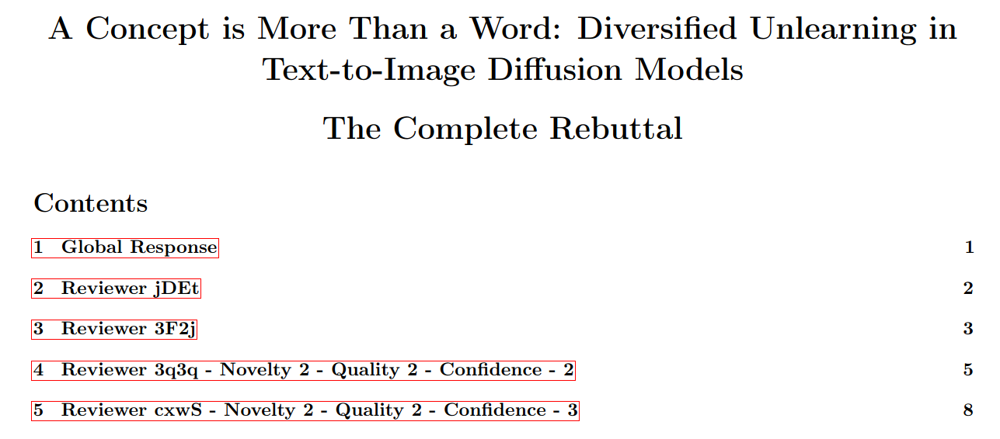
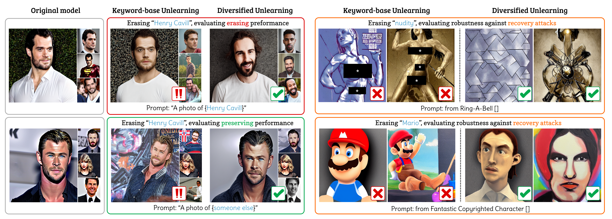

<div align="center">

# DIVERSIFIED UNLEARNING

## [Conference] A concept is more than a word: Diversified Unlearning in Text-to-Image Diffusion models

</div>

## The complete rebuttal

<p align="center">
	
</p>


### Dear Reviewer, kindly refer to the attached [KDD26___Distributional_Unlearning_Rebuttal.pdf](assets/KDD26___Distributional_Unlearning_Rebuttal.pdf) for our complete responses to all your comments.

<br>
<br>

<p align="center">
	
</p>

> ### A concept is more than a word: Diversified Unlearning in Text-to-Image Diffusion models

> Concept unlearning has emerged as a promising direction for reducing the risks of harmful content generation in text-to-image diffusion models by selectively erasing undesirable concepts from a model’s parameters. Existing approaches typically rely on keywords to identify the target concept. However, we show that this keyword-based formulation is inherently limited: concepts are multi-dimensional, can be expressed in diverse textual forms, and often overlap with related concepts in the latent space, making keyword-only unlearning brittle and prone to over-forgetting. To address this limitation, we propose **Diversified Unlearning**, a distributional framework that represents a concept through a set of contextually diverse prompts rather than a single keyword. This richer representation enables more precise and robust unlearning. Through extensive experiments across multiple benchmarks and state-of-the-art baselines, we demonstrate that Diversified Unlearning consistently achieves stronger erasure, better retention of unrelated concepts, and improved robustness against adversarial recovery attacks


## Enviroment setups
```bash
git clone https://github.com/TruongDuy2607/Diversified_Unlearning.git
cd Diversified_Unlearning
wget https://huggingface.co/CompVis/stable-diffusion-v-1-4-original/resolve/main/sd-v1-4-full-ema.ckpt && mv sd-v1-4-full-ema.ckpt models/erase/
```
Create conda enviroments and install the depended packages:
```bash
conda create -n dv-unlearn python=3.10
conda activate dv-unlearn
pip install -r requirements.txt
```

## Usage

> **Note:** Diversified Unlearning is an add-on method that can be integrated with existing baseline approaches. Our experimental implementations compare the performance before and after combining Diversified Unlearning with these baseline methods.
 ### 1. Training
 We provide training and evaluation scripts in `train-scripts` and `eval-scripts` folders, with 4 base methods: [ESD](https://github.com/rohitgandikota/erasing), [UCE](https://github.com/rohitgandikota/unified-concept-editing), [AP](https://github.com/tuananhbui89/Erasing-Adversarial-Preservation), and [AGE](https://github.com/tuananhbui89/Adaptive-Guided-Erasure).

 **For baseline ESD**
 ```bash
 CUDA_VISIBLE_DEVICES=0 python3 train-scripts/ESD/train-esd.py --train_method "xattn" --prompt "henry cavill"
 ```
 **For integrate Diversified Unlearning to ESD**
 ```bash
 CUDA_VISIBLE_DEVICES=0 python3 train-scripts/ESD/train-esd-diverse.py --prompt_csv "diverse_prompts/celebs/multi-level/training_prompts/level1_henry-cavill.csv" --seperator "," --train_method "xattn" --prompt "henry cavill" --level "level-1"
 ```

 The implementation for other baseline methods (UCE, AP, AGE) follows the same pattern. For detailed commands and configurations, please refer to [run.sh](run.sh).

### 2. Generate images
```bash
CUDA_VISIBLE_DEVICES=0 python3 eval-scripts/generate-images.py --models_path=final-models --model_name=${model_name} --prompts_path ${path_to_prompt_file} --save_path "results" --num_samples 1 --from_case 0 --to_case -1
```
